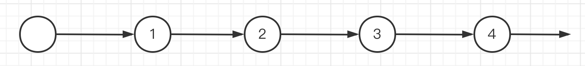
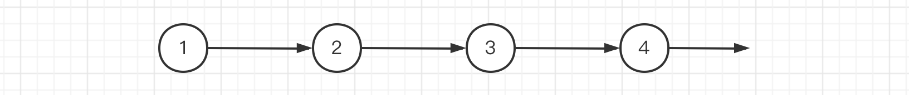
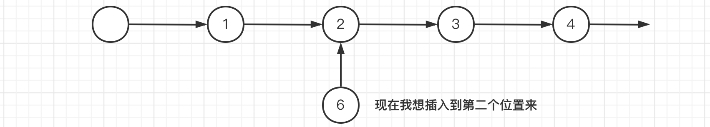

# 线性表

什么是线性表？  
> 线性表是由同一类型的数据元素构成的有序序列的线性结构。线性表中元素的个数就是线性表的长度，表的起始位置称为表头，表的结束位置称为表尾，当一个线性表中没有元素时，称为空表。  

线性表和数组的区别？
> **线性表**：线性表不仅能获取任意位置数据，同时能够实现增删数据，线性表从1开始。
> **数组**：初始化长度为固定的数据结构，不易实现在任意位置的增删操作，数组从0开始。

线性表功能：

+ **初始化线性表**：将一个线性表进行初始化，得到一个全新的线性表。
+ **获取指定位置上的元素**：直接获取线性表指定位置i上的元素。
+ **获取元素的位置**：获取某个元素在线性表上的位置i。
+ **插入元素**：在指定位置i上插入一个元素。
+ **删除元素**：删除指定位置i上的一个元素。
+ **获取长度**：返回线性表的长度。  

简单来说，线性表就是列表。比如书架上的图书，我们希望能够随意添加几本书，或者从任意位置获取想要的图书。

  

如何实现线性表？  

> + 一种是顺序存储实现，使用数组实现。
> + 另一种使用链式存储实现，使用链表。

---

## 顺序表

什么是顺序表？
> 既然数组无法实现这样的高级表结构，那么我就基于数组，对其进行强化，也就是说，我们存放数据还是使用数组，但是我们可以为其编写一些额外的操作来强化为线性表，像这样底层依然采用顺序存储实现的线性表，我们称为顺序表。  

  

```C
#include <stdio.h>
#include <stdlib.h>

/* 初始化线性表结构体 */
typedef int E;

struct list {
    E *array;           /* 线性表底层数组 */
    int capacity;       /* 线性表容量 */
    int size;           /* 线性表元素数量 */
};

typedef struct list * listArray;

/*
*   brief: 初始化
*/
int initList(listArray list)
{
    list->array = (E *)malloc(sizeof(E) * 10);
    if (list->array == NULL)
    {
        return -1;
    }
    list->capacity = 10;
    list->size = 0;

    return 0;
};

/*
*   brief: 插入元素
*/
int insertList(listArray list, E element, int index)
{
    /* 判断index是否在list内，[1, list->capacity] */
    if (index < 1 || index > list->size + 1)
    {
        return -1;
    }
    /* 判断list是否超过容量 */
    if (list->size == list->capacity)
    {
        E *newArray = (E *)realloc(list->array, sizeof(E) * list->capacity * 2);
        if (newArray == NULL)
        {
            return -2;
        }
        list->array = newArray;
        list->capacity *= 2; 
    }
    
    /* 先将数据后移一位 */
    for (int i = list->size; i > index - 1; i--)
    {
        list->array[i] = list->array[i - 1];
    }
    list->array[index - 1] = element;
    list->size++;

    return 0;
}

/*
*   brief: 删除元素
*/
int deleteList(listArray list, int index)
{
    /* 判断是否在list内部 */
    if (index < 1 || index > list->size)
    {
        return -1;
    }
    
    /* 将数组前移一位 */
    for (int i = index; i < list->size; i++)
    {
        list->array[i - 1] = list->array[i];
    }
    list->size--;

    return 0;
}

/*
*   brief: 获取list长度
*/
int getListSize(listArray list)
{
    return list->size;
}

/*
*   brief: 获取list指定位置元素
*/
E* getListElement(listArray list, int index)
{
    /* 参数判断 */
    if (index < 1 || index > list->size)
    {
        return NULL;
    }
    
    return &(list->array[index-1]);
}

/*
*   brief: 获取list指定元素的位置
*/
int findListIndex(listArray list, E element)
{
    /* 参数判断 */
    if (list == NULL)
    {
        return -1;
    }
    
    for (int i = 0; i < list->size; i++)
    {
        if (list->array[i] == element)
        {
            return i+1;
        }
    }
    
    return 0;
}

/*
*   brief: 打印线性表内容
*/
void printList(listArray list)
{
    if (list == NULL || list->size == 0)
    {
        printf("linear list is null!");
    }

    for (int i = 0; i < list->size; i++)
    {
        printf("%d ", list->array[i]);
    }
    printf("\n");
}

/*
*   brief: 测试函数
*/
int main(void)
{
    struct list list;
    if (initList(&list) == 0)
    {
        for (int i = 1; i <= 30; i++)
        {
            insertList(&list, i, i);
        }
        printList(&list);
        printf("list size: %d\n", list.size);

        deleteList(&list, 10);    
        printList(&list);
        printf("list size: %d\n", list.size);
    } else
    {
        printf("liner list init failed!");
    }  
}
```  

使用数组实现的线性表，插入、删除、获取元素操作的时间复杂度？

+ **插入**：需要将插入位数据后移一位，平均时间复杂度为 *O(n)*。
+ **删除**：需要将插入位数据前移一位，平均时间复杂度为 *O(n)*。
+ **获取**：直接使用数组下标获取，平均时间复杂度为 *O(1)*。

---

## 链表

什么是链表？
> 链表通过内部指针链接各个分散节点，形成一个链状结构。链表每个节点存放一个元素和指向下个节点的指针，通过指针一个个连接，形成了链表。

链表分类：

+ **带头节点链表**：第一个节点为头节点，节点不存放数据，只是单纯指向第一个节点。

+ **不带头节点链表**：第一个节点包含数据，作为第一个节点。


前驱节点和后继节点

+ **前驱节点**：要插入位置的前一个节点。
+ **后继节点**：要插入位置原来的节点，插入后，插入位置后一个节点。


图中*节点1*为前驱节点，*节点3*为后继节点。链表插入和删除关键就是要找到**前驱节点**。

```C
#include <stdio.h>
#include <stdlib.h>

/* 定义链表结构体 */
typedef int E;

struct listNode {
    E element;
    struct listNode *next;
};

typedef struct listNode *list;

/*
*   brief: 初始化
*/
int initList(list head)
{
    head->next = NULL;

    return 0;
}

/*
*   brief: 链表插入
*/
int insertList(list head, E element, int index)
{
    /* 参数判断 */
    if (index < 1)
    {
        return -1;
    }
    
    /* 寻找要插入的前驱节点 */
    while (--index)
    {
        head = head->next;
        if (head == NULL)
        {
            return -2;
        } 
    }
    
    list node = (list)malloc(sizeof(struct listNode));\
    if (node == NULL)
    {
        return -1;
    }
    node->element = element;
    node->next = head->next;
    head->next = node;

    return 0;
}

/*
*   brief: 链表删除
*/
int deleteList(list head, int index)
{
    /* 参数判断 */
    if (index < 1)
    {
        return -1;
    }

    /* 寻找要删除的前驱节点 */
    while (--index)
    {
        head = head->next;
        if (head == NULL)
        {
            return -2;
        } 
    }

    /* 删除节点位置为空 */
    if (head->next == NULL)
    {
        return -3;
    }
    
    list tmp = head->next;
    head->next = head->next->next;
    free(tmp);

    return 0;
}

/*
*   brief: 获取链表指定位置元素
*/
E* getListElement(list head, int index)
{
    /* 参数判断 */
    if (index < 1)
    {
        return NULL;
    }

    head = head->next;

    while (--index)
    {
        head = head->next;
        if (head == NULL)
        {
            return NULL;
        }    
    }
    
    return &head->element;
}

/*
*   brief: 获取链表指定元素的位置
*/
int getListIndex(list head, E element)
{
    int index = 0;
    
    while (head->next != NULL)
    {
        head = head->next;
        index++;
        if (head->element == element)
        {
            return index;
        }
    }
    
    return -1;
}

/*
*   brief: 获取链表长度
*/
int getListSize(list head)
{
    int size = 0;

    while (head->next != NULL)
    {
        head = head->next;
        size++;
    }
    
    return size;
}

/*
*   brief: 打印链表
*/
void printList(list head)
{
    int count = 0;
    /* 头节点为空 */
    head = head->next;
    while (head)
    {
        printf("%d ", head->element);
        head = head->next;
        count++;
    }
    printf("\n");
    printf("listNode amount is %d.\n", count);
}

/*
*   brief: 初始化，用于测试程序
*/
int main(void)
{
    struct listNode head;

    if (initList(&head) == 0)
    {
        insertList(&head, 111, 1);
        insertList(&head, 222, 2);
        insertList(&head, 333, 3);
        printList(&head);
        printf("wanted element in %d.\n", getListIndex(&head, 212));
        printf("liseNode amount is %d.\n", getListSize(&head));

        E *element = getListElement(&head, 4);
        if (element)
        {
            printf("element is %d\n", *element);
        }
        deleteList(&head, 3);
        printList(&head);
    } else 
    {
        printf("listNode init failed!\n");
    }
    
}
```

使用链表，插入、删除、获取元素操作的时间复杂度？

+ **插入**：需要查找节点的前驱位置，平均时间复杂度为 *O(n)*。
+ **删除**：需要查找节点的前驱位置，平均时间复杂度为 *O(n)*。
+ **获取**：需要逐个节点向后遍历，平均时间复杂度为 *O(n)*。

什么情况下使用顺序表？什么情况下使用链表？
> 通过分析顺序表和链表的特性不难发现，链表在随机访问元素时，需要通过遍历来完成，而顺序表则利用数组的特性直接访问得到，所以，*当读取数据多于插入或是删除数据的情况下时，使用顺序表会更好*。
> 而顺序表在插入元素时就显得有些鸡肋了，因为需要移动后续元素，整个移动操作会浪费时间，而链表则不需要，只需要修改结点 指向即可完成插入，所以*在频繁出现插入或删除的情况下，使用链表会更好*。
---

## 双向链表

双向链表最好有尾节点
